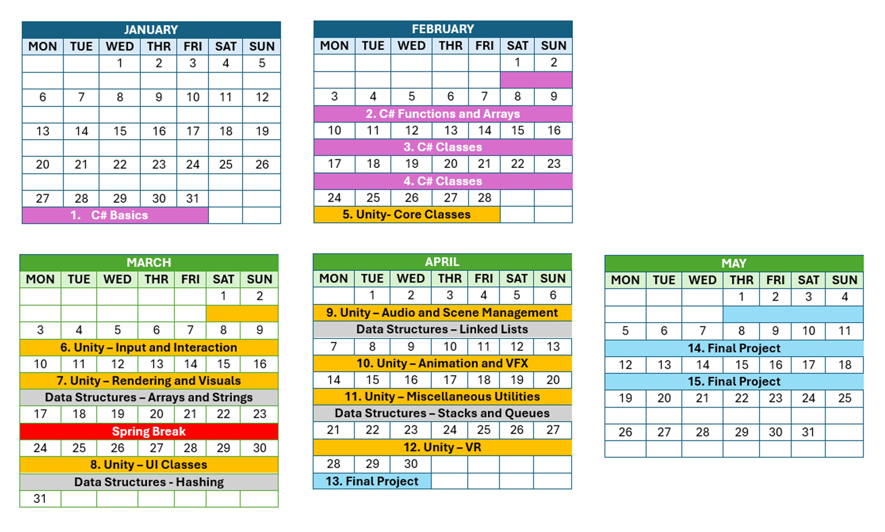

# 🎓 Unity & VR Development Tutorial 

Welcome to the Unity & VR Development Tutorial! This course is designed for **absolute beginners**, with no prior experience in **C#** or **Unity**. We'll start from the basics and guide you through coding, game development, and virtual reality. 

## 📝 Course Overview
By the end of this course, you will:
* ✅ Understand the basics of programming with C#.
* ✅ Learn how to use Unity 3D to create interactive scenes.
* ✅ Develop simple games and interactive applications.
* ✅ Explore the fundamentals of Virtual Reality (VR) development.

## 📚 Course Plan

